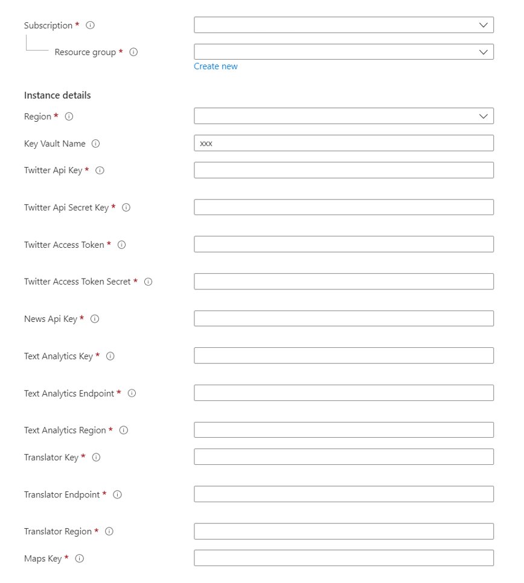
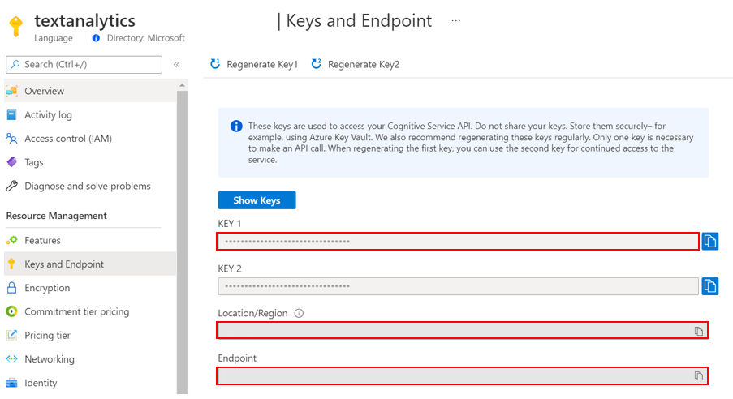
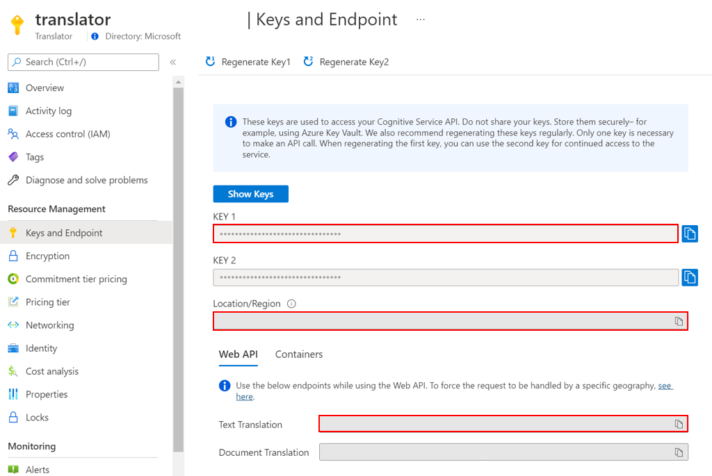
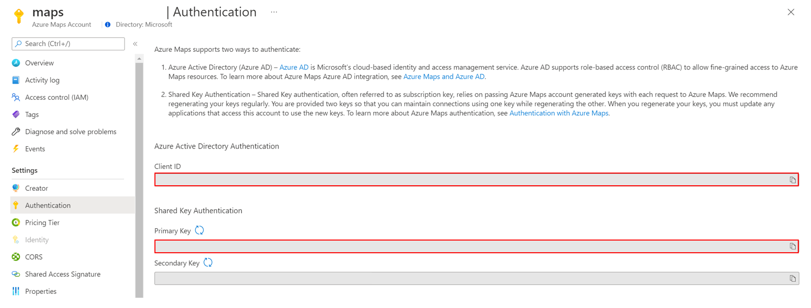
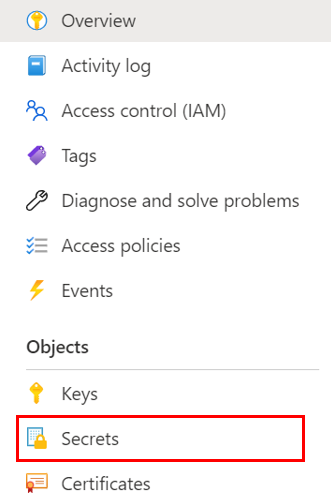
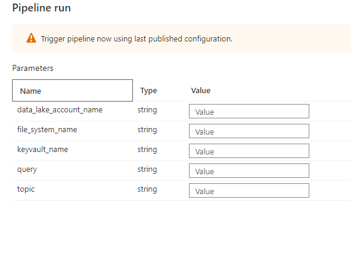

# Deployment Guide 
Please follow the steps below to set up the Azure environment

## Step 1: Download Files
Clone or download this repository and navigate to the project's root directory.

## Step 2: Deploy Key Vault Secrets 
The button below will deploy secrets into the Azure Key Vault you are using for this solution:

> Note: This deployment assumes you have created a [Twiter developer account](https://developer.twitter.com/en/portal/dashboard) with "Elevated" access to the Twitter API's features (check out this [link](https://developer.twitter.com/en/docs/twitter-api/getting-started/getting-access-to-the-twitter-api) for more info on the access levels) and a [News API account](https://newsapi.org/).

### **Configuring the ARM template**
In order to deploy the secrets into the Azure Key Vault, we need to configure the following variables.

 

Populate the variables accordingly: 

1. **Resource group**: Use the `same resource group` where the previous ARM template was deployed.
2. **Region**: This field will be auto-filled
3. **Key Vault Name**: The name of the Azure Key Vault that was created during previous steps
 > The Twitter API keys and tokens (4-7) can be obtained in your [Twiter developer account](https://developer.twitter.com/en/portal/dashboard) 
4. **Twitter API Key**
5. **Twitter API Secret Key**
6. **Twitter Access Token**
7. **Twitter Access Token Secret**

8. **News API Key**: can be obtained from [newsapi.org](https://newsapi.org/)
9. **Text Analytics Key**: The key for your Text Analytics resource that was created in previous steps 
10. **Text Analytics Endpoint**: The endpoint for your Text Analytics resource that was created in previous steps 
11. **Text Analytics Region**: The region your Text Analytics resouce is in

12. **Translator Key**: The key to your Translator resource that was created in previous steps
13. **Translator Endpoint**: The endpoint to your Translator resource that was created in previous steps
14. **Translator Region**: The region your Translator resource is in 

15. **Map Key**: The key to your Map resource that was created in previous steps 

## Step 3: Security Access
### Step 3.1: Add Azure Synapse to Azure Key Vault 
1. Go to the Key Vault that was created in the previous step 
2. Click `Access policies`, click `+ Add Access Policy`, on the new window, on the `Secret Permissions` select `Get` and `List`. 
3. On the `Select principal` option, add your synapse resource name to be added to the Key vault and click `Save`
4. Select `Review + create` and `Save` the changes made. 

### Step 3.2: Add your IP address to Synapse firewall
Before you can upload assets to the Synapse Workspace you will need to add your IP address:
1. Go to the Synapse resouce you created in the previous step. 
2. Navigate to `Networking` under `Security` on the left hand side of the page.
3. At the middle of the screen click `+ Add client IP`
      
4. Your IP address should now be visible in the IP list

### Step 3.3: Update storage account permisions 
In order to perform the necessary actions in Synapse workspace, you will need to grant more access.
1. Go to the Azure Data Lake Storage Account for your Synapse Workspace
2. Go to the `Access Control (IAM) > + Add > Add role assignment` 
3. Now search and select the `Storage Blob Data Contributor` role and click "Next" 
4. Click "+ Select members", search and select your username and click "Select" 
5. Click `Review and assign` at the bottom

[Learn more](https://docs.microsoft.com/azure/synapse-analytics/security/how-to-set-up-access-control)

## Step 4: Set up Assets and load Data

### Step 4.1: Attach libraries to spark cluster
1. Launch the Synapse workspace [Synapse Workspace](https://ms.web.azuresynapse.net/)
2. Select the `subscription` and `workspace` name you are using for this solution accelerator
3. Navigate to the `Manage` tab in the Studio and click on the `Apache Spark pools`  

5. Click `...` on the deployed Spark Pool and select `Packages`
6. Click `Upload` and select [requirements.txt](https://github.com/microsoft/Azure-Social-Media-Analytics-Solution-Accelerator/blob/main/Code/requirements.txt) from the cloned repo.
7. Click `Apply`

### Step 4.2: Create Key Vault Linked Service 
1. Launch the Synapse workspace [Synapse Workspace](https://ms.web.azuresynapse.net/)
2. Select the `subscription` and `workspace` name you are using for this solution accelerator
3. Navigate to the `Manage` Hub, under "External connection" click `Linked services`
4. Click `+ New`, select `Azure Key Vault`, select the subscription you are using for this solution from the "Azure Subscription" dropdown, and select your Azure Key Vault name from the "Azure key vault name" dropdown
5. Change the name of the linked service to `KeyVaultLinkedService`
6. Click "Test connection" and click "Save"

### Step 4.3: Upload Country Coordinates Dataset

1. Launch the Synapse workspace [Synapse Workspace](https://ms.web.azuresynapse.net/)
2. Select the `subscription` and `workspace` name you are using for this solution accelerator
3. In Synapse Studio, navigate to the `Data` Hub
4. Select `Linked`
5. Under the category `Azure Data Lake Storage Gen2` you'll see an item with a name like `xxxxx(xxxxx- Primary)`
6. Select the container named `socialmediaadlsfs (Primary)`, select "New folder", enter `CountryCoordinates` and select "Create"
    * In the `CountryCoordinates` folder, select `Upload` to upload the .csv file [CountryCoordinates.csv](https://github.com/microsoft/Azure-Social-Media-Analytics-Solution-Accelerator/blob/main/Data/CountryCordinates/CountryCordinates.csv)
  
### Step 4.4: Upload Noteboks
1. Launch the Synapse workspace [Synapse Workspace](https://ms.web.azuresynapse.net/)
2. Go to `Develop`, click the `+`, and click `Import` to select all notebooks from this repository's [folder](https://github.com/microsoft/Azure-Social-Media-Analytics-Solution-Accelerator/tree/main/Code/Notebooks)
3. For each of the notebooks, select `Attach to > spark1` in the top dropdown
<!-- 4. Configure the parameters in the following 3 notebooks and publish the changes
    * `Process_News_Twitter_Data.ipynb`
    * `Ingest_Process_News.ipynb`
    * `Ingest_Process_Tweets.ipynb` -->

### Step 4.5: Set up Pipelines
1. In Synapse workspace, go to `Integrate`, click the "+", and choose `Pipeline`
2. The new `Pipeline 1` appears, click on the three dots `...` on the right corner , click `Rename`, change the pipeline name to `Process_News_and_Twitter_Data_Pipeline`
3. Click the `{}` button at the top right corner to open the Code window
4. Copy and paste the contents of [Process_News_and_Twitter_Data_Pipeline.json](https://github.com/microsoft/Azure-Social-Media-Analytics-Solution-Accelerator/tree/main/Code/Pipelines/Process_News_and_Twitter_Data_Pipeline.json)
5. Click `OK` to apply.
6. Click `Publish all` at the top of the page.
7. Click `Add trigger`, select `Trigger now` Trigger the pipeline and populate the parameters as shown below:

* **data_lake_account_name**: your storage accont name, example: synapsestrgz99t9l9.
* **file_system_name**: the Synapse Workspace ADLS FileSystem name `socialmediaadlsfs`.
* **Key Vault Name**: the name of the Key Vault Linked Service, example: sma-textanalytics-z99.
* **query**: the query to be executed on social media sources. [How to query Twitter](https://developer.twitter.com/en/docs/twitter-api/v1/rules-and-filtering/search-operators)
* **topic**: the topic used to tag the data collected, it is used to group it in the dashboard. 

You can also set default values for those parameters, so you don't need to type them every time your trigger it.

Alternatively, add a scheduled trigger to run the pipeline daily.

## Step 5: Power BI Set Up 

1. Open the [Power BI report template](https://github.com/microsoft/Azure-Social-Media-Analytics-Solution-Accelerator/blob/main/Power%20BI/SocialMediaAnalyticsSA-Template.pbit) in this repository

2. Enter the Synapse Serverless SQL endpoint and `default` for SQLPool/database name when prompted
   * Navigate to the Synapse Workspace overview page in the Azure Portal, copy the Serverless SQL endpoint

3. Select `Refresh` after all the tables load and the dashboard with three pages shows up.
