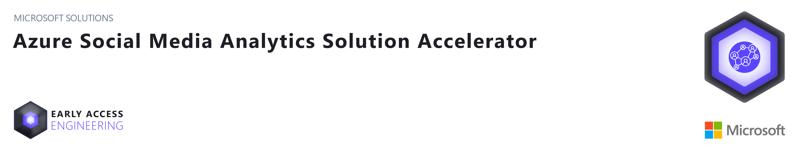
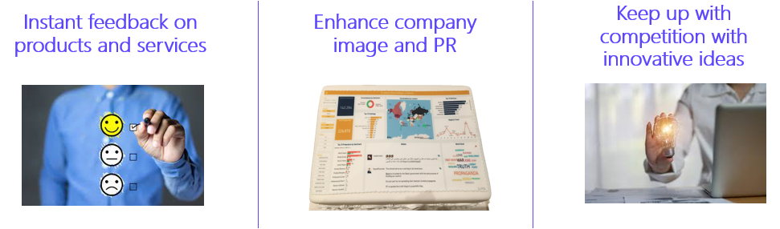
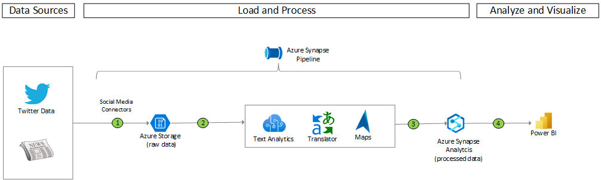

## About this Repository

Monitoring social media has become important for companies and organizations around the world. It is an essential tool for innovation and marketing. Its benefits range from the ability to get instant feedback on products and services, allowing better relations with end users and customers, providing a means to increase user satisfaction very quickly, and keeping up with the competition.

This solution accelerator helps developers with all the resources needed to build a Social Media monitoring platform that helps collect data from social media sites and websites and evaluate that data to make business decisions

 

## Prerequisites
To use this solution accelerator, you will need access to an [Azure subscription](https://azure.microsoft.com/en-us/free/). While not required, a prior understanding of Azure Synapse Analytics, Azure Cognitive Services, Azure Maps and Power BI  will be helpful.

For additional training and support, please see:

1. [Azure Synapse Analytics](https://azure.microsoft.com/en-us/services/synapse-analytics/)
2. [Azure Text Analytics](https://azure.microsoft.com/en-us/services/cognitive-services/text-analytics)
2. [Azure Translator](https://azure.microsoft.com/en-us/services/cognitive-services/translator)
3. [Azure Maps](https://docs.microsoft.com/en-us/azure/azure-maps/about-azure-maps)
5. [Power BI](https://docs.microsoft.com/en-us/power-bi/fundamentals/power-bi-overview)

## Getting Started

### ***Note***
Azure Cogntive Services require to accept the terms and conditions of Responsible AI when they are first provisioned in an Azure subscription. If none of the Cognitive Services were provisioned previously in the Azure subscription, it is necessary to create a temporary cognitive service (for example Language Service) to accept the AI license terms. The service can be dropped after the creation. Once the requirements are in place, the deploy to Azure button can be used to deploy and configure the solution.

The button below will deploy Azure Synapse Analytics, Azure Language Service, Azure Translator, Azure Maps and its related resources:

> NOTE: Currently Maps is only available in the following regions: `East US`, `North Europe`, `West Central US`, `West Europe` and `West US 2`. In the template we are using `East US` for the Map service. If you need to use another region, please change the template with one of the above regions. 

* Go to the [Deployment guide](./Deployment/Deployment.md) to set up your Azure resources for this solution.  

## Architecture

The architecture diagram below details what you will be building for this Solution Accelerator.

## Power BI Dashboards

**Summary Dashboard** - View notable topics, hashtags, influencers, accounts, and locations where there's heightened interest

**Twitter Dashboard** - Gauge customer interest in your company, products, or services based on information from customer tweets

**News Dashboard** - Understand the conversations around your company, products, or services (or that of your competitors) in the news

## License
MIT License

Copyright (c) Microsoft Corporation.

Permission is hereby granted, free of charge, to any person obtaining a copy
of this software and associated documentation files (the "Software"), to deal
in the Software without restriction, including without limitation the rights
to use, copy, modify, merge, publish, distribute, sublicense, and/or sell
copies of the Software, and to permit persons to whom the Software is
furnished to do so, subject to the following conditions:

The above copyright notice and this permission notice shall be included in all
copies or substantial portions of the Software.

THE SOFTWARE IS PROVIDED "AS IS", WITHOUT WARRANTY OF ANY KIND, EXPRESS OR
IMPLIED, INCLUDING BUT NOT LIMITED TO THE WARRANTIES OF MERCHANTABILITY,
FITNESS FOR A PARTICULAR PURPOSE AND NONINFRINGEMENT. IN NO EVENT SHALL THE
AUTHORS OR COPYRIGHT HOLDERS BE LIABLE FOR ANY CLAIM, DAMAGES OR OTHER
LIABILITY, WHETHER IN AN ACTION OF CONTRACT, TORT OR OTHERWISE, ARISING FROM,
OUT OF OR IN CONNECTION WITH THE SOFTWARE OR THE USE OR OTHER DEALINGS IN THE
SOFTWARE

## Note about Libraries with MPL-2.0 and LGPL-2.1 Licenses   
The following libraries are not **explicitly included** in this repository, but users who use this Solution Accelerator may need to install them locally and in Azure Synapse and Azure Machine Learning to fully utilize this Solution Accelerator. However, the actual binaries and files associated with the libraries **are not included** as part of this repository, but they are available for installation via the PyPI library using the pip installation tool.  
  
Libraries: chardet, certifi

## Contributing
This project welcomes contributions and suggestions.  Most contributions require you to agree to a Contributor License Agreement (CLA) declaring that you have the right to, and actually do, grant us the rights to use your contribution. For details, visit https://cla.opensource.microsoft.com.

When you submit a pull request, a CLA bot will automatically determine whether you need to provide a CLA and decorate the PR appropriately (e.g., status check, comment). Simply follow the instructions provided by the bot. You will only need to do this once across all repos using our CLA.

This project has adopted the [Microsoft Open Source Code of Conduct](https://opensource.microsoft.com/codeofconduct/). For more information see the [Code of Conduct FAQ](https://opensource.microsoft.com/codeofconduct/faq/) or contact [opencode@microsoft.com](mailto:opencode@microsoft.com) with any additional questions or comments.

## Trademarks
This project may contain trademarks or logos for projects, products, or services. Authorized use of Microsoft trademarks or logos is subject to and must follow [Microsoft's Trademark & Brand Guidelines](https://www.microsoft.com/en-us/legal/intellectualproperty/trademarks/usage/general). Use of Microsoft trademarks or logos in modified versions of this project must not cause confusion or imply Microsoft sponsorship. Any use of third-party trademarks or logos are subject to those third-party's policies.

## Data Collection
The software may collect information about you and your use of the software and send it to Microsoft. Microsoft may use this information to provide services and improve our products and services. You may turn off the telemetry as described in the repository. There are also some features in the software that may enable you and Microsoft to collect data from users of your applications. If you use these features, you must comply with applicable law, including providing appropriate notices to users of your applications together with a copy of Microsoft's privacy statement. Our privacy statement is located at https://go.microsoft.com/fwlink/?LinkID=824704. You can learn more about data collection and use in the help documentation and our privacy statement. Your use of the software operates as your consent to these practices.

